# Jen - Mindfulness and Stress Reduction App

A Flutter-based mobile application designed to promote mindfulness and help users reduce stress through guided exercises, journaling, and emotional awareness.

## Project Overview

Jen provides a calming, minimalistic interface focused on mental clarity and simplicity. Built with Flutter and themed using the Catppuccin color palette, the app offers both light and dark themes with a modern aesthetic that enhances the mindfulness experience. The app features comprehensive wellness tracking, audio-guided exercises, and personalized user experiences.

## Core Features

### Wellness Tracking
- **Daily Affirmations**: Rotating motivational quotes with the ability to favorite and save your preferred affirmations
- **Journal**: Private space for thoughts and reflections with persistent storage, date filtering, and rich text editing
- **Mood Tracker**: Log daily emotions with visual feedback, view mood history, and track weekly emotional trends with charts
- **Calendar View**: Unified timeline displaying all activities (journal entries, mood logs, lockdown sessions) with filtering options

### Mindfulness Exercises
- **Breathing Exercises**: Audio-guided breathing sessions with voice cues for inhale/hold/exhale patterns, session tracking, and completion statistics
- **Lockdown Mode**: Enhanced focus feature with app blocking capabilities, timer management, session history, and productivity tracking

### Health & Wellness
- **Water Reminder**: Daily hydration tracking with goal setting (8 glasses), visual progress indicators, and streak tracking

### Personalization
- **Light/Dark Mode**: Complete theme support with Catppuccin Mocha (dark) and Latte (light) color palettes
- **User Personalization**: Custom greeting on home screen with first-time user onboarding
- **Haptic Feedback**: Enhanced tactile responses across all interactive elements

## Tech Stack

- **Framework**: Flutter (Dart)
- **Database**: SQLite for local data persistence
- **Local Storage**: SharedPreferences for user settings
- **Audio**: AudioPlayers for guided meditation and breathing exercises
- **Charts**: FL Chart for mood visualization
- **Typography**: Google Fonts (Nunito, Merriweather)
- **Design Theme**: Catppuccin Mocha & Latte color palettes
- **State Management**: Provider
- **UI/UX**: [Figma Wireframes](https://lid-couch-37881953.figma.site/)

## Development Approach

This project follows a milestone-based development approach managed through GitHub Projects:

- **Milestone 1**: UI implementation, navigation, and static layouts
- **Milestone 2**: Data persistence, state management, and feature integration
- **Extra Features**: Audio-guided exercises, calendar/timeline view, water tracking, theme enhancements, and polish

## Team

- **Suzal Regmi** - Development & Implementation
- **Diana Avila** - Planning, Design & Documentation

## Getting Started

### Prerequisites

```bash
flutter --version  # Flutter 3.0 or higher
```

### Installation

```bash
git clone https://github.com/Motaphe/Jen.git
cd jen
flutter pub get
flutter run
```

## Architecture

### Sequence Diagram

The following diagram illustrates the main user interactions and data flows in the Jen application:

```mermaid
sequenceDiagram
    actor User
    participant Main as Main App
    participant Home as Home Screen
    participant DB as Database Helper
    participant Prefs as Preferences Helper
    participant Theme as Theme Provider
    participant Screen as Feature Screen
    participant Audio as Audio Player

    %% App Initialization
    User->>Main: Launch App
    Main->>Theme: Initialize ThemeProvider
    Main->>DB: Load journal entries
    Main->>DB: Load mood entries
    Main->>Prefs: Check first launch
    Main->>Prefs: Get user name

    alt First Launch
        Main->>User: Show welcome dialog
        User->>Main: Enter name
        Main->>Prefs: Save user name
        Main->>Prefs: Mark first launch complete
    end

    Main->>Home: Render Home Screen
    Home->>User: Display dashboard

    %% Theme Toggle
    User->>Home: Toggle theme
    Home->>Theme: Toggle dark/light mode
    Theme->>Home: Update UI

    %% Affirmations Flow
    User->>Home: Navigate to Affirmations
    Main->>Screen: Show Affirmations Screen
    Screen->>DB: Check if liked
    Screen->>User: Display affirmation

    alt Like Affirmation
        User->>Screen: Click like button
        Screen->>DB: Save favorite affirmation
        Screen->>User: Show confirmation
    end

    User->>Screen: Click next
    Screen->>Screen: Shuffle & show next

    %% Journal Flow
    User->>Home: Navigate to Journal
    Main->>Screen: Show Journal Screen
    User->>Screen: Create new entry
    Screen->>User: Show editor
    User->>Screen: Enter title & content
    User->>Screen: Select date
    User->>Screen: Save entry
    Screen->>DB: Create journal entry
    DB->>Screen: Return entry ID
    Screen->>Screen: Update entry list

    alt Edit Entry
        User->>Screen: Tap entry
        Screen->>User: Show editor with data
        User->>Screen: Update & save
        Screen->>DB: Update journal entry
    end

    alt Delete Entry
        User->>Screen: Swipe entry
        Screen->>DB: Delete journal entry
        Screen->>User: Show confirmation
    end

    %% Mood Tracker Flow
    User->>Home: Navigate to Mood Tracker
    Main->>Screen: Show Mood Tracker Screen
    User->>Screen: Select mood (1-5)
    User->>Screen: Click log mood
    Screen->>DB: Create mood entry
    DB->>Screen: Return entry ID
    Screen->>DB: Get last week moods
    DB->>Screen: Return mood data
    Screen->>Screen: Render mood chart
    Screen->>User: Display updated chart

    %% Breathing Exercise Flow
    User->>Home: Navigate to Breathing
    Main->>Screen: Show Breathing Screen
    User->>Screen: Click start
    Screen->>Audio: Play intro audio
    Screen->>Screen: Start 60s countdown

    loop Breathing Cycle (4-4-4)
        Screen->>Audio: Play "inhale" cue
        Screen->>Screen: Animate circle expand
        Screen->>Audio: Play "hold" cue
        Screen->>Screen: Hold animation
        Screen->>Audio: Play "exhale" cue
        Screen->>Screen: Animate circle shrink
    end

    alt Session Complete
        Screen->>Audio: Play outro audio
        Screen->>DB: Create breathing entry (completed=true)
        Screen->>User: Show completion message
    else Session Stopped Early
        Screen->>DB: Create breathing entry (completed=false)
        Screen->>Audio: Stop audio
    end

    %% Lockdown Mode Flow
    User->>Home: Navigate to Lockdown
    Main->>Screen: Show Lockdown Screen
    User->>Screen: Select duration
    User->>Screen: Toggle lofi music
    User->>Screen: Click start
    Screen->>User: Request task name
    User->>Screen: Enter task (optional)
    Screen->>Screen: Start timer countdown

    alt Lofi Enabled
        Screen->>Audio: Shuffle track list
        loop Until Timer Complete
            Screen->>Audio: Play next lofi track
            Audio->>Screen: Track complete
        end
    end

    alt Timer Complete
        Screen->>Audio: Stop music
        Screen->>DB: Create lockdown entry (completed=true)
        Screen->>User: Show completion dialog
    else User Exits Early
        Screen->>User: Confirm exit
        User->>Screen: Confirm
        Screen->>Audio: Stop music
        Screen->>DB: Create lockdown entry (completed=false)
    end

    %% Water Reminder Flow
    User->>Home: Navigate to Water Reminder
    Main->>Screen: Show Water Reminder Screen
    Screen->>DB: Get today's water entries
    Screen->>Screen: Start 2-hour timer
    Screen->>User: Display progress (X/8 glasses)

    alt Manual Log
        User->>Screen: Click log water now
        Screen->>DB: Create water entry (confirmed=true)
        Screen->>User: Update progress
    end

    alt Reminder Timer
        Screen->>User: Show reminder dialog
        User->>Screen: Confirm/Dismiss
        Screen->>DB: Create water entry
        Screen->>User: Update progress
    end

    %% Calendar View
    User->>Home: Navigate to Calendar
    Main->>Screen: Show Calendar Screen
    Screen->>DB: Get all journal entries
    Screen->>DB: Get all mood entries
    Screen->>DB: Get all lockdown entries
    Screen->>DB: Get all water entries
    Screen->>DB: Get all breathing entries
    Screen->>Screen: Merge & sort by date
    Screen->>User: Display unified calendar

    User->>Screen: Select date from calendar
    Screen->>Screen: Filter activities by selected date
    Screen->>User: Display activities for date
```



## Project Management

Development progress and task tracking are managed through [GitHub Projects](https://github.com/users/Motaphe/projects/2).